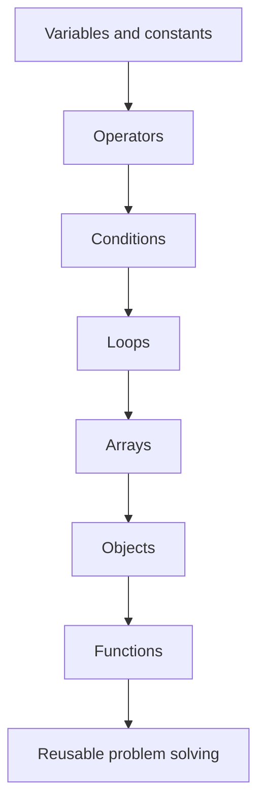
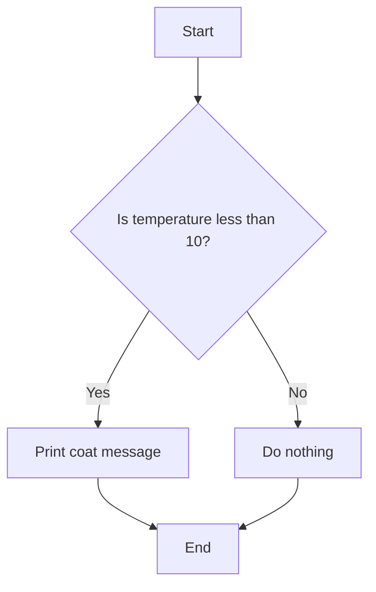
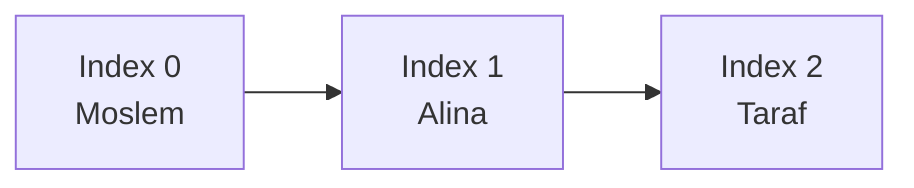
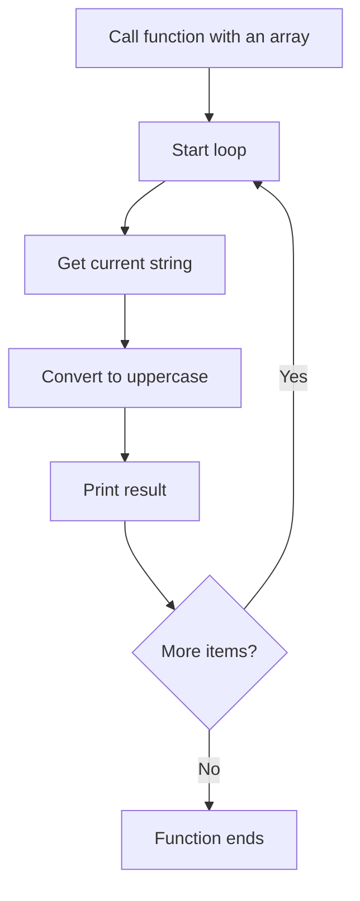
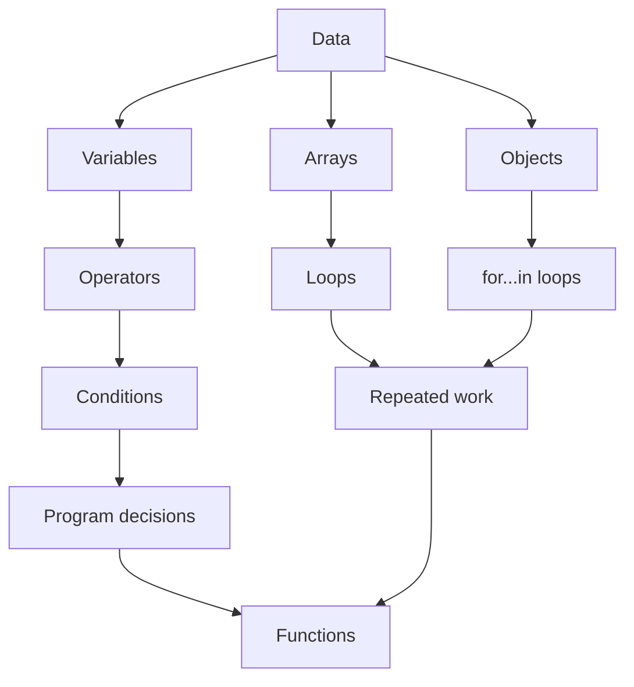

# JavaScript Topics

This project is a beginner-friendly collection of small JavaScript examples.
It covers the first building blocks you need before moving into bigger
projects: variables, operators, conditions, loops, arrays, objects, and
functions.

The goal is not to memorize syntax. The goal is to understand how JavaScript
stores data, makes decisions, repeats work, and organizes reusable code.

## Project Files

```text
js-topics/
|-- index.html   # Loads the JavaScript file in the browser
|-- app.js       # JavaScript examples and practice code
`-- README.md    # Project guide
```

## How To Run The Project

Open `index.html` in your browser.

Then open the browser developer tools and look at the Console tab. Most of the
examples use `console.log()` to print results.

You can edit `app.js`, refresh the browser, and check the console again.

## Learning Map



This diagram shows the learning order. Each topic builds on the previous one.
For example, loops are much more useful after you understand variables and
conditions. Functions become more useful after you have repeated code that you
want to reuse.

## 1. Variables And Constants

Variables store values so you can use them later.

Use `let` when the value may change.

```js
let temperature = 25;
temperature = 30;

console.log(temperature);
```

Use `const` when the value should not be reassigned.

```js
const country = "Tunisia";

console.log(country);
```

Think of a variable like a labeled box. The label is the variable name, and the
value is what you put inside the box.

## 2. Arithmetic Operators

Arithmetic operators help you do math.

| Operator | Meaning | Example |
| --- | --- | --- |
| `+` | Addition | `10 + 5` |
| `-` | Subtraction | `10 - 5` |
| `*` | Multiplication | `10 * 5` |
| `/` | Division | `10 / 5` |
| `%` | Remainder | `10 % 3` |

Example:

```js
let num1 = 10;
let num2 = 20;
let num3 = 30;

let average = (num1 + num2 + num3) / 3;

console.log(average);
```

The parentheses are important because we want to add the numbers first, then
divide the total by `3`.

## 3. Comparison Operators

Comparison operators answer a yes-or-no question. The result is always a
boolean: `true` or `false`.

| Operator | Meaning |
| --- | --- |
| `>` | Greater than |
| `>=` | Greater than or equal to |
| `<` | Less than |
| `<=` | Less than or equal to |
| `===` | Strictly equal |
| `!==` | Not strictly equal |

Example:

```js
let age = 18;

console.log(age >= 18); // true
console.log(age < 18);  // false
```

Prefer `===` instead of `==` because `===` checks the value and the type.

```js
console.log(5 === 5);   // true
console.log(5 === "5"); // false
```

## 4. Logical Operators

Logical operators let you combine conditions.

| Operator | Meaning | Example |
| --- | --- | --- |
| `&&` | AND: both sides must be true | `age >= 18 && hasTicket` |
| `||` | OR: at least one side must be true | `isAdmin || isModerator` |
| `!` | NOT: reverses true/false | `!isLoggedIn` |

Example:

```js
let temperature = 35;

if (temperature > 30 && temperature < 37) {
  console.log("Go out and enjoy your day!");
}
```

This condition only runs when the temperature is greater than `30` and less
than `37`.

## 5. If Statement

An `if` statement runs code only when a condition is true.

```js
let temperature = 8;

if (temperature < 10) {
  console.log("Please wear your coat!");
}
```



The diamond is the decision point. JavaScript checks the condition and chooses
which path to follow.

## 6. If Else Statement

Use `if...else` when you want one result if the condition is true and another
result if it is false.

```js
let isLoggedIn = false;

if (isLoggedIn) {
  console.log("Welcome back!");
} else {
  console.log("Please log in.");
}
```

## 7. If Else If Statement

Use `if...else if...else` when you have more than two possible cases.

```js
let connected = "moderator";

if (connected === "user") {
  console.log("Welcome User!");
} else if (connected === "moderator") {
  console.log("Welcome Moderator!");
} else if (connected === "admin") {
  console.log("Welcome Admin!");
} else {
  console.log("Welcome!");
}
```

This checks each condition from top to bottom. The first matching condition
runs, then the rest are skipped.

## 8. Switch Statement

A `switch` statement is another way to compare one value against many possible
cases.

```js
let connected = "moderator";

switch (connected) {
  case "user":
    console.log("Welcome User!");
    break;

  case "moderator":
    console.log("Welcome Moderator!");
    break;

  case "admin":
    console.log("Welcome Admin!");
    break;

  default:
    console.log("Welcome!");
    break;
}
```

Use `break` to stop JavaScript from continuing into the next case.

## 9. For Loop

A `for` loop repeats code a specific number of times.

```js
for (let i = 0; i < 3; i++) {
  console.log("Hello");
}
```

This prints `"Hello"` three times.

The loop has three parts:

```js
for (start; condition; update) {
  // repeated code
}
```

In this example:

| Part | Code | Meaning |
| --- | --- | --- |
| Start | `let i = 0` | Start counting from 0 |
| Condition | `i < 3` | Keep looping while this is true |
| Update | `i++` | Add 1 after each loop |

## 10. Arrays

An array stores a list of values.

```js
let names = ["Moslem", "Alina", "Taraf"];
```

Arrays use index numbers. The first item is at index `0`.

```js
console.log(names[0]); // Moslem
console.log(names[1]); // Alina
console.log(names[2]); // Taraf
```



This diagram shows an important beginner rule: arrays start counting from zero,
not one.

## 11. Array Length

Use `.length` to know how many items are inside an array.

```js
let colors = ["red", "green", "blue"];

console.log(colors.length); // 3
```

This is useful because you usually do not want to hard-code the final index.

## 12. Looping Over An Array

You can combine a `for` loop with `.length` to visit every item in an array.

```js
let colors = ["red", "green", "blue"];

for (let i = 0; i < colors.length; i++) {
  console.log(colors[i].toUpperCase());
}
```

What happens step by step:

| Loop | `i` value | `colors[i]` |
| --- | --- | --- |
| 1 | `0` | `"red"` |
| 2 | `1` | `"green"` |
| 3 | `2` | `"blue"` |

The output is:

```text
RED
GREEN
BLUE
```

## 13. Functions

A function is a reusable block of code.

Function declaration syntax:

```js
function convertToUpperCase(strings) {
  for (let i = 0; i < strings.length; i++) {
    console.log(strings[i].toUpperCase());
  }
}

convertToUpperCase(["red", "green", "blue"]);
```

This function accepts an array of strings and prints each string in uppercase.



Functions are useful because they help you avoid repeating the same code.

## 14. Returning Values From Functions

Some functions print something. Other functions calculate a result and return
it.

```js
function sum(numbers) {
  let total = 0;

  for (let i = 0; i < numbers.length; i++) {
    total += numbers[i];
  }

  return total;
}

const result = sum([10, 20, 30, 40]);

console.log("Sum:", result);
```

The function returns `100`, then we store that value in `result`.

## 15. Objects

An object stores related information using key-value pairs.

```js
let person = {
  firstName: "Adam",
  lastName: "Smith",
  age: 30,
  id: "123cvl",
  height: 1.72,
};
```

In this object:

| Key | Value |
| --- | --- |
| `firstName` | `"Adam"` |
| `lastName` | `"Smith"` |
| `age` | `30` |
| `id` | `"123cvl"` |
| `height` | `1.72` |

## 16. Accessing Object Properties

You can access object properties with dot notation:

```js
console.log(person.firstName);
console.log(person.age);
```

You can also use bracket notation:

```js
console.log(person["firstName"]);
console.log(person["age"]);
```

Dot notation is simpler when you know the property name. Bracket notation is
useful when the property name comes from a variable.

```js
let propertyName = "firstName";

console.log(person[propertyName]); // Adam
```

## 17. Template Literals

Template literals make it easier to build strings using variables.

```js
let description = `this is ${person.firstName} ${person.lastName} he is ${person.age} years old`;

console.log(description);
```

The `${...}` parts are replaced with real values from the object.

## 18. Adding A Property Dynamically

You can add a new property to an object after the object is created.

```js
const car = {
  color: "red",
  brand: "Toyota",
  model: "Camry",
  maxSpeed: 250,
};

car.owner = "Moslem Ajra";

console.log(car);
```

Now the `car` object has a new `owner` property.

## 19. Deleting A Property

Use `delete` to remove a property from an object.

```js
delete car.maxSpeed;

console.log(car);
```

Be careful with `delete`. In real projects, removing data can affect other
parts of the code that expect that property to exist.

## 20. Looping Over An Object

Use `for...in` to loop over the keys of an object.

```js
for (let key in car) {
  console.log(key, car[key]);
}
```

If the car object is:

```js
const car = {
  color: "red",
  brand: "Toyota",
  model: "Camry",
  wheels: 4,
};
```

The loop prints each key and its value:

```text
color red
brand Toyota
model Camry
wheels 4
```

## Big Picture: How These Topics Work Together



The story of this diagram:

- Variables store single values.
- Arrays store lists of values.
- Objects store related data with names.
- Operators help compare or calculate values.
- Conditions let the program choose what to do.
- Loops repeat work.
- Functions organize that work so it can be reused.

## Practice Challenges

Try these after reading the examples.

1. Create three variables for three exam scores and calculate the average.
2. Write an `if...else` statement that checks if a user is old enough to drive.
3. Create an array of five favorite foods and print each one using a loop.
4. Create a function that receives an array of numbers and returns the largest number.
5. Create a `student` object with `name`, `age`, and `level`.
6. Add a new property called `isActive` to the `student` object.
7. Loop over the `student` object and print every key and value.

## Common Beginner Mistakes

- Arrays start at index `0`, not index `1`.
- Use `===` for comparison, not `=`.
- `=` assigns a value. `===` compares two values.
- Do not forget `break` inside a `switch` case.
- Do not forget to call a function after defining it.
- Use `.length` when looping over an array instead of hard-coding the number of items.

## Recommended Next Topics

After you are comfortable with this project, good next topics are:

1. More array methods: `push`, `pop`, `map`, `filter`, and `reduce`.
2. More function practice with parameters and return values.
3. DOM basics: selecting HTML elements and changing the page with JavaScript.
4. Events: responding to clicks, typing, and form submissions.
5. Small projects, such as a calculator, todo list, or quiz app.
